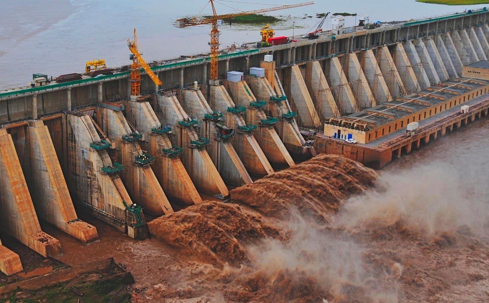

**The Roseieres dam**

The Roseires dam is located on the Blue Nile at Ad Damazin, just upstream of the town of Er Roseires, in Sudan. 
It consists of a concrete buttress dam 1 km wide with a maximum height of 68 m, and an earth dam on either side. 
The earth dam on the eastern bank is 4 km long, and that on the western bank is 8.5 km long. The reservoir has a surface area of about 290 km2.

Roseires Reservoir lake
The dam was completed in 1966, initially for irrigation purposes. A power generation plant, with a maximum capacity of 280 megawatts, was added in 1971. 
A heightening (and lengthening) project was completed in 2013 and the dam is now 25 km long.

* embedded Unit information 

|No. Unit  |Capacity  | Date Commissioned  | Turbine Manufacturer  | Turbine Type  | Genrator Manufacturer| Type of Ownership |
| 4        |   40 MW  |       1971         |    Voest Austria      |  Kaplan       |      Asea Brown Bo   |    Government     |
| 3        |   40 MW  |       1989         |    Boving Co          |  Kaplan       |     Asea Brown Bo    |     Government    |
 
* Link to WiKiPedia page 
[Link] (https://en.wikipedia.org/wiki/Roseires_Dam#:~:text=The%20Roseires%20Dam%20%28Arabic%3A%20%D8%AE%D8%B2%D8%A7%D9%86%20%D8%A7%D9%84%D8%B1%D9%88%D8%B5%D9%8A%D8%B1%D8%B5%29%20is%20a,m%2C%20and%20an%20earth%20dam%20on%20either%20side.)

